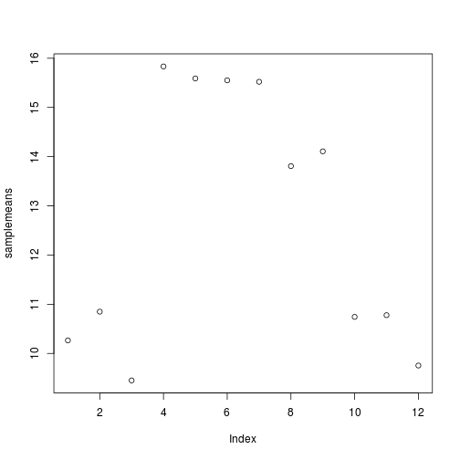
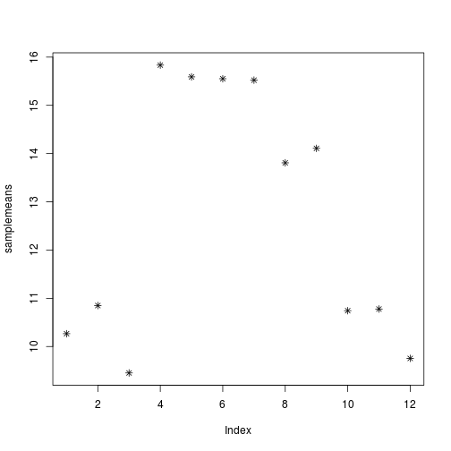
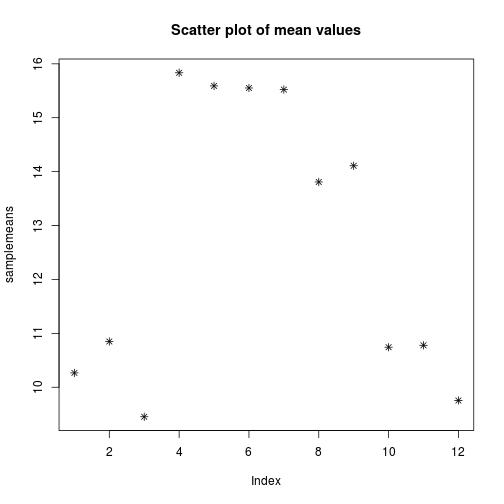
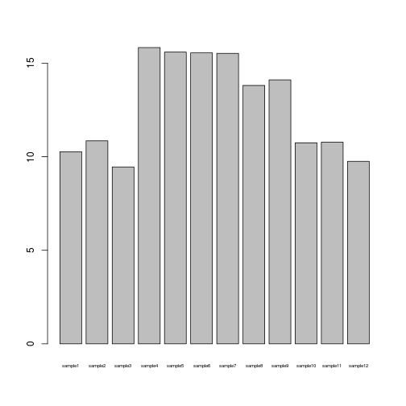
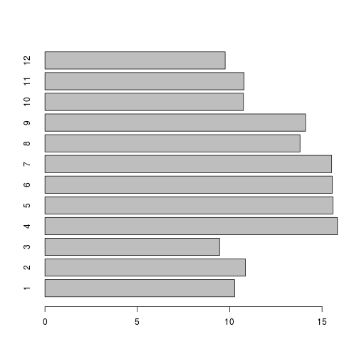
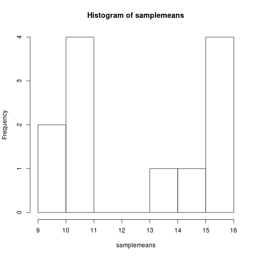
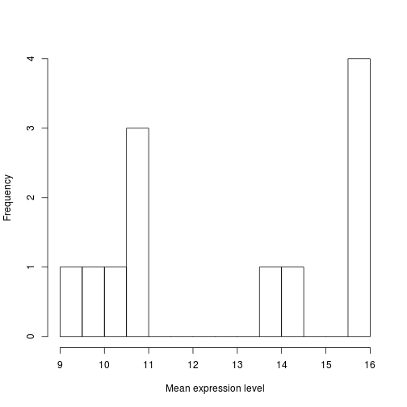
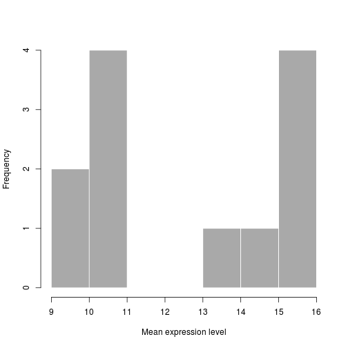
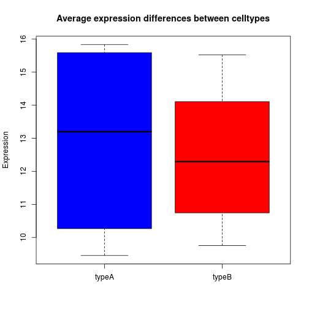

------
layout: topic
title: Analyzing and Plotting Data
minutes: 60
---


> ## Learning Objectives {.objectives}
>
> * Generating simple statistics from the data (across levels of a factor)
> * A few basic plots using mock data
> * Basic plots using RNA-Seq data: scatter plots, boxplots, histograms (base functions)
> * Introducing ggplot2: scatter plots, boxplots, histograms (base functions)
> * Advanced plots: correlation heat map ,scatterplot, PCA, histogram of average values
> * Writing to file
> * Not covered: working with missing values? unique?


# Calculating statistics

Let's get a closer look at our data. Each column represents a sample in our experiment, and each sample has ~38K values corresponding to the expression of different transcripts. Suppose we wanted to compute the average value for a sample, or the minimum and maximum values? The R base package provides many built-in functions such as `mean`, `median`, `min` and `max`, `range`. Try computing the mean for "sample1" (_Hint: apply what you have learned previously on indexing_)  


```r
mean(annotated_rpkm[,'sample1'])
```

Hmm, we just get `NA`. That's because we don't have the values for every transcript in this sample
and **missing data is recorded as `NA`**. By default, all R functions operating on vectors that contains missing data will return NA. It's a way to make sure that users know they have missing data, and make a conscious decision on how to deal with it.

When dealing with simple statistics like the mean, the easiest way to ignore `NA` (the missing data) is to use `na.rm=TRUE` (`rm` stands for remove). Try computing the `mean` again, also test out some of the other functions.


```r
# Mean 
mean(annotated_rpkm[,'sample1'], na.rm=T)

# Maximum
max(annotated_rpkm[,'sample1'], na.rm=T)

# Minimum
min(annotated_rpkm[,'sample1'], na.rm=T)
```

In some cases, it might be useful to remove the missing data from the vector. For this purpose, R comes with the function `na.omit` to generate a vector that has NA's removed. For some applications, it's useful to keep all observations, for others, it might be best to remove all observations that contain missing data. The function
`complete.cases()` returns a logical vector indicating which rows have no missing values. We can use the logical vector to remove rows that contain at least one missing observation. If we do this on our data, how many rows are we left with?


```r
rpkm_noNA <- annotated_rpkm[complete.cases(annotated_rpkm), ]
dim(rpkm_noNA)
```

> ### Challenge {.challenge}
> Can you compute the [standard error](http://en.wikipedia.org/wiki/Standard_error) for "sample1". (hints: there is no built-in function to compute standard errors, but there may be functions for the different components of the formula)

## The Apply Function
To obtain mean values for all samples we can use `mean` on each column individually, but there is also an easier way to go about it. The `apply` family of functions keep you from having to write loops (R is bad at looping) to perform some sort of operation on every row or column of a data matrix or a data frame. The family includes several functions, each differing slightly on the inputs or outputs.


```r
base::apply             Apply Functions Over Array Margins
base::by                Apply a Function to a Data Frame Split by Factors
base::eapply            Apply a Function Over Values in an Environment
base::lapply            Apply a Function over a List or Vector
base::mapply            Apply a Function to Multiple List or Vector Arguments
base::rapply            Recursively Apply a Function to a List
base::tapply            Apply a Function Over a Ragged Array
```

We will be using `apply` in our examples today, but do take a moment on your own to explore the many options that are available. The `apply` function returns a vector or array or list of values obtained by applying a function to margins of an array or matrix. We know about vectors/arrays and functions, but what are these “margins”? Margins are referring to either the rows (denoted by 1), the columns (denoted by 2) or both (1:2). By “both”, we mean  apply the function to each individual value. Let's try this with the mean function on our data with NAs removed `rpkm_noNA`, but remember to index and remove the first column of gene symbols before input (because gene symbols are characters and not numeric, the `mean` function will return an error).


```r
samplemeans <- apply(rpkm_noNA[,2:13], 2, mean) 
```

_How long is the vector of values returned?_

# Basic plots in R

The mathematician Richard Hamming once said, "The purpose of computing is insight, not numbers", and the best way to develop insight is often to visualize data. Visualization deserves an entire lecture (or course) of its own, but we can explore a few features of R's base plotting package.

When we are working with large sets of numbers it can be useful to display that information graphically. R has a number of built-in tools for basic graph types such as hisotgrams, scatter plots, bar charts, boxplots and much [more](http://www.statmethods.net/graphs/). We'll test a few of these out here on our `samplemeans` vector, but first we will create a combined data frame that maps our metadata to the sample mean values.


```r
# Create a combined data frame
all(rownames(metadata) == names(samplemeans)) # sanity check for sample order
df <- cbind(metadata, samplemeans) 
```

Let's start with a **scatterplot**. A scatter plot provides a graphical view of the relationship between two sets of numbers. We don't have a variable in our metadata that is a continous variable, so there is nothing to plot it against but we can plot the values against their index values just to demonstrate the function.


```r
plot(samplemeans)
```

 

Each point represents a sample and the value on the x-axis is the sample number, where the values on the y-axis correspond to the average expression for that sample. For any plot you can customize many features of your graphs (fonts, colors, axes, titles) through [graphic options](http://www.statmethods.net/advgraphs/parameters.html)
For this scatterplot we'll add a title to the plot with `main` in addition to changing the shape of the data point using `pch`.


```r
plot(samplemeans, pch=8)
```

 

```r
plot(samplemeans, pch=8, main="Scatter plot of mean values")
```

 

In the case of our data, a **barplot**  would be much more useful. We can use `barplot` to draw a single bar representing each sample and the height indicates the average expression level. 


```r
barplot(samplemeans)
```

 

The sample names appear to be too large for the plot, we can change that by changing the `cex.names` value. Alternatively we can also just change the names to be numeric values and keep the same size.


```r
barplot(samplemeans, cex.names=0.5)
```

 

```r
barplot(samplemeans, names.arg=c(1:12)) # supply numbers as labels
```

 

We can also flip the axes so that the plot is projected horizontally.


```r
barplot(samplemeans, names.arg=c(1:12), horiz=TRUE) 
```

 

If we are interested in an overall distribution of values, **histogram** is a plot very commonly used. It plots the frequencies that data appears within certain ranges. To plot a histogram of the data use the `hist` command:


```r
hist(samplemeans)
```

 
The range of values for sample means is 22 to 39. As you can see R will automatically calculate the intervals to use. There are many options to determine how to break up the intervals. Let's increase the number of breaks to see how that changes the plot:


```r
hist(samplemeans, xlab="Mean expression level", main="", breaks=20) 
```

 

Similar to the other plots we can tweak the aesthetics. Let's color in the bar and remove the borders:

```r
hist(samplemeans, xlab="Mean expression level", main="", col="darkgrey", border=FALSE) 
```

 

Using addiitonal sample information from our metadata, we can use plots to compare values between the two different celltypes 'typeA' and 'typeB' using a **boxplot**. A boxplot provides a graphical view of the median, quartiles, maximum, and minimum of a data set. 


```r
# Boxplot
boxplot(samplemeans~celltype, df)
```

 

Similar to the plots aboev, we can pass in arguments to add in extras like plot title, axis labels and colors.


```r
boxplot(samplemeans~celltype, df,  col=c("blue","red"),
        main="Average expression differences between celltypes", ylab="Expression")
```

 

